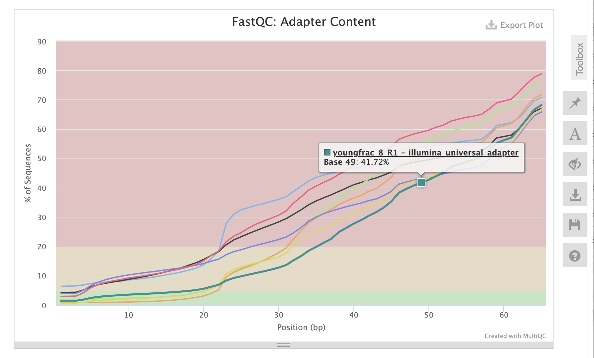
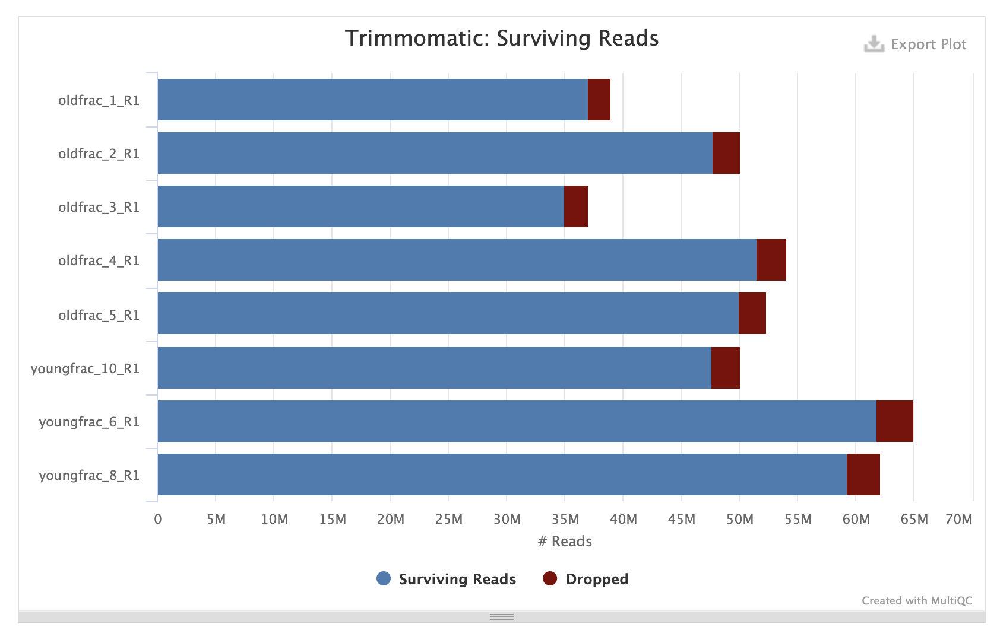
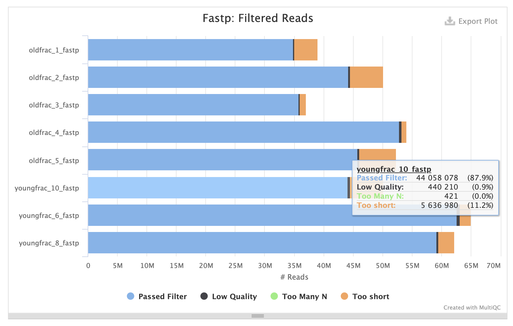
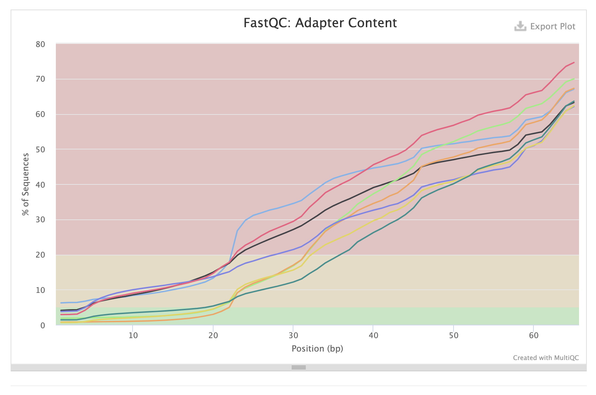
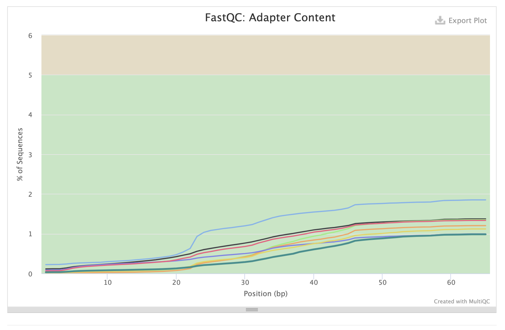
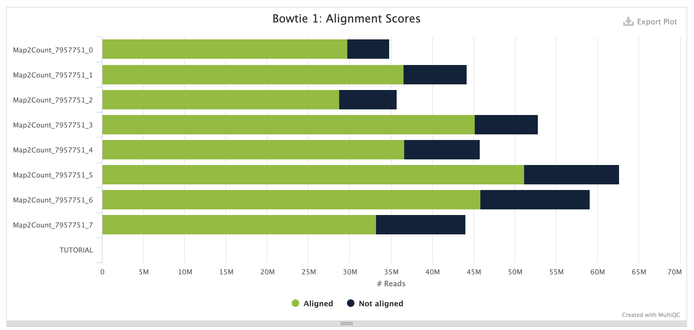
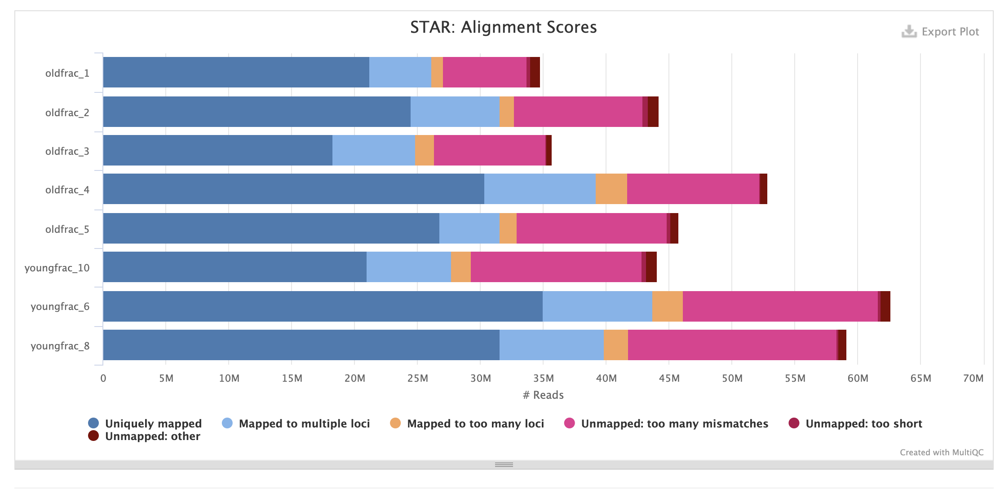
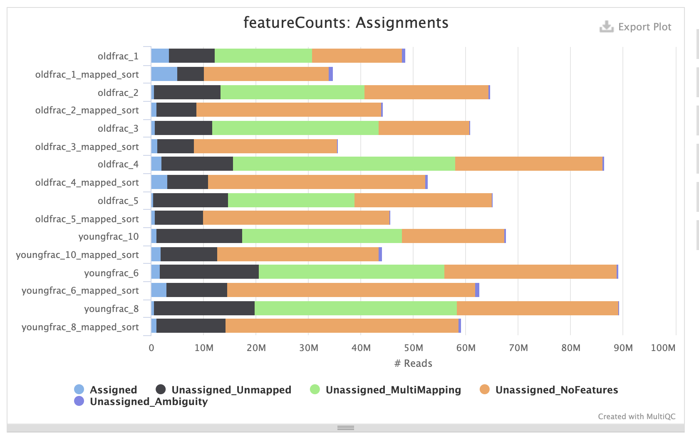

## miRNA Analysis 

Analysis Steps

- [Introduction](#introduction)
- [Software/packages](#softwarepackages-required)
- [Resource download](#resources)
- [Reference Index](#Index)
- [Read QC and Trimming](#read-qc--3-step-process)


### Introduction

MiRNA sequencing (miRNAseq) and mRNA sequencing (mRNAseq) are both powerful techniques used in genomics to study RNA molecules, but they serve distinct purposes and offer different insights into cellular processes. miRNAseq focuses on the analysis of microRNAs, which are short, non-coding RNA molecules that play a critical role in regulating gene expression by targeting mRNAs and preventing their translation into proteins. This technique helps in understanding the post-transcriptional regulation of gene expression and has important implications in studies related to developmental biology and disease mechanisms, particularly in cancer research. On the other hand, mRNAseq analyzes messenger RNA molecules, providing a broad overview of the actively expressed genes in a cell at a given time. This approach is crucial for gene expression profiling, identifying upregulated and downregulated genes, and exploring functional genomics. While mRNAseq gives a snapshot of the transcriptional landscape, offering insights into the functional components of the genome, miRNAseq provides a deeper understanding of the regulatory networks that control these transcriptional processes. Together, these methods complement each other, enhancing our understanding of cellular dynamics and molecular biology.

In miRNA since the target molecule of detection is fairly small.  The precursor miRNA has a stable hairpin (~70bps) that produces a mature miRNA of ~22bps long.  Due to their short length generally Illumina Single End sequencing is carried out.

In this project we are investigating the differential expression of mature miRNA to investigate their regulatory role in fracture healiong in young old mouse.

### Software/packages required

The list of required tools with their version number is listed below.
- samtools/1.16.1
- seqtk/1.3
- bowtie-1.2.3
- STAR/2.7.11a
- fastqc/0.11.7
- Trimmomatic/0.39
- fastp/0.23.2
- subread/2.0.3
- DESeq2

### Project Directory Layout
```
.
├── 00_resources
│   ├── BowtieIndex
│   └── StarIndex
├── 02_qualityQC
│   ├── fastp_qc
│   ├── RAWfastqc_OUT
│   ├── TrimReads_fastp
│   ├── TrimReads_fastp_qc
│   ├── TrimReads_trimmo
│   └── TrimReads_trimmo_qc
├── 03-mapping
├── 04_featureCount
├── rawdata
├── scripts
│   └── logs
├── TMPDIR
└── tools
    └── bowtie-1.2.3
```

### Resources
For this analysis we will be using the Mouse miRNA annotation information from miRBase that corresponds to GRCm38 assembly (equivalent is mm10). First step will be to download resources needed for this analysis.
1. Mouse Genome fasta file (mm10)
2. miRNA gff file (mmu.gff3 from miRBase)

The complete code to run this step with SLURM header is in `00_resource_process.sh`. The code part is given below

```
module load samtools/1.16.1
module load seqtk/1.3

mkdir -p ../00_resources

cd ../00_resources

###############################
#     GENOME
###############################
wget https://hgdownload.soe.ucsc.edu/goldenPath/mm10/bigZips/mm10.fa.gz
# Uncompress Genome fasta file
gunzip mm10.fa.gz

# Select complete chromosmes (chr1...chr19,chrX and chrY)
# Selected chromosomes are listed in chromosomes_selected.txt with one chromosome ID per line.
# It is worth removing MT sequences here if study doesnot involve MT features.
seqtk mm10.fa chromosomes_selected.txt > mm10_selected.fa

# Deleting the downloaded fasta file.
rm mm10.fa

# Renaming selected sequence fasta file
mv mm10_selected.fa mm10.fa

# Index fasta file
samtools faidx mm10.fa

#Get chromosome sizes
cut -f1,2 mm10.fa.fai > chromosome.sizes.genome

# Download miRNA gff3 file from miRBAse
wget https://www.mirbase.org/download/mmu.gff3

```

### Index

The next step is to prepare reference for mapping and here we will use 2 different aligners (bowtie and STAR). The code below is used to generate index for using bowtie and STAR aligner in two directories `BowtieIndex` and `StarIndex` respectively.  Refer script in scripts folder.
```
BOWTIE_DIR=/core/projects/GAP/CBC/ADelany_UCHC_miRNAseq_Apr2024/tools/bowtie-1.2.3

mkdir -p BowtieIndex
# Creating bowtie Index
${BOWTIE_DIR}/bowtie-build mm10.fa ./BowtieIndex/mm10

module load STAR/2.7.11a

mkdir -p StarIndex

# Creating STAR Index
STAR \
        --runThreadN 6 \
        --runMode genomeGenerate \
        --genomeDir ./StarIndex \
        --sjdbGTFfile mm10.gtf \
        --sjdbOverhang 1 \
        --genomeFastaFiles mm10.fa

```
### Read QC : 3 Step Process

The complete script with all 3 process is in scripts folder `02_fastqc_trim_fastqc.sh`

#### STEP1 : FastQC

Quality check of RAW data.  `FastQC` was used for looking into quality of reads.  The code below is used for running the QC step.

```
# ${sampleID} : refers to sample ID
fastqc -t 6 -o ./RAWfastqc_OUT ../01_merged_reads/${sampleID}_R1.fastq.gz

```
The samples have read depth ranging from 35M to 65M.  A high degree of adapter contamination was observed as can be seen in the figure below.


#### STEP2: Read Trimming

In order to remove low QUality bases and adapters 2 packages were tried to eliminate these issues from the reads `Trimmomatic` and `fastp`

```
java -jar $Trimmomatic SE -threads 6 \
        ../rawdata/${sampleID}_R1.fastq.gz \
        ./TrimReads_trimmo/trim_tm_${sampleID}_R1.fastq.gz \
        ILLUMINACLIP:${ADAPTERFILE}:2:30:10:5 \
        SLIDINGWINDOW:4:25 MINLEN:10


fastp --thread 4 \
        --in1 ../rawdata/${sampleID}_R1.fastq.gz \
        --out1 ./TrimReads_fastp/trim_fp_${sampleID}_R1.fastq.gz \
        --json ./fastp_qc/${sampleID}_fastp.json \
        --html ./fastp_qc/${sampleID}_fastp.html
```
The Trimming action can be seen in images below.

##### Trimmomatic



##### Fastp



#### Step3 : Post Trim QC
In order to evaluate which tools has worked better in removing the dapaters and bad bases the `FastQC` was ran on trim reads and the adpater contamination status from from booth tools is shown below.

##### Trimmomatic



##### Fastp




`fastp` appears to be more robust in remooving adapter contamination as against Trimmomatic.  However this need to be investigated as why Trimmomatic failed miserably. Since the fastp trim reads were good, we will use them in downstream analysis.

#### Read Mapping

For aligning the fastp trimmed reads we use `bowtie and STAR aligners the code below describe parameters used for aligning both aligners their respective scripts are available in scripts folder.

**Bowtie** alignmnet, script: `03a_mapping_bowtie.sh`
`bowtie-align-s` was used as it is configured to facilitate short reads.

```
${BOWTIE_DIR}/bowtie-align-s -p 6 \
	../../resources/BowtieIndex/GRCm38 \
	../../02_qualityQC/TrimReads_fastp/trim_fp_${sampleID}_R1.fastq.gz \
	-S ${sampleID}.sam
```

**STAR** alignmnet, script: `03b_mapping_STAR.sh`

```
params=' --runThreadN 6
--sjdbGTFfile ../../resources/mm10.gtf
--alignEndsType EndToEnd
--outFilterMismatchNmax 1
--outFilterMultimapScoreRange 0
--quantMode TranscriptomeSAM GeneCounts
--outReadsUnmapped Fastx
--outFilterMultimapNmax 10
--outSAMunmapped Within
--outFilterScoreMinOverLread 0
--outFilterMatchNminOverLread 0
--outFilterMatchNmin 16
--alignSJDBoverhangMin 1000
--alignIntronMax 1
--outWigType wiggle
--outWigStrand Stranded
--outWigNorm RPM
'
STAR --genomeDir ../../resources/StarIndex --readFilesIn ../../02_qualityQC/TrimReads_fastp/trim_fp_${sampleID}_R1.fastq $params --outFileNamePrefix ${sampleID} --outSAMtype BAM SortedByCoordinate

```
The mapping stats of both alligner are shown below.

##### Bowtie



##### STAR




#### Feature Count

The `featureCount` function of subread package was used to perfomr quantification of feature `miRNA` using the gff3 file.  The bam file from both STAR and bowtie were used.

The code is below and the script is in `scripts` folder.

```
# Creating list of bamfile stored in variable ${bam}
bam=""
for i in ${SAMPLES[@]}; do  bam="${bam} ${i}_mapped_sort.bam"; done

module load subread/2.0.3

featureCounts -F GTF \
        -t miRNA \
        -g 'Name' \
        -a ${miRNAgff3} \
        -o ${OUTDIR}/bt-counts.txt \
        ${bam}

```

The featurecount performance on bowtie and STAR bam files can be seen below.



It appears that bowtie bam files have performed marginally better than STAR alignment files.  The count matrix generated from bowtie aligned reads was used in `R` for calling differential expression.

The Script used in DESeq2 is in scripts folder and the pdf and html version of R notebook is availble in this directory.

DE expression and then pathway analysis is done using DESeq2 and clusterprofiler.